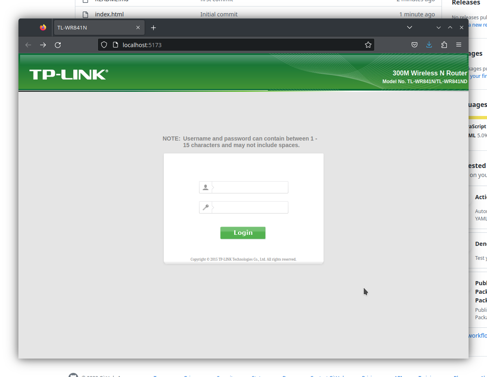

# TP-LINK honeypot

Re-created same look like admin panel for catching newbie haxorz!

This project is WIP made for (DD|Open)WRT firmware to trick/gather user/pass combo 



### Plan:
    [ ] Working login with admin/admin
    [ ] React router implementation
    [ ] Login save capability
    [ ] Dummy data to fake real clients (not just bots)

### Develop

The project is made with vite. To run the app, first clone the repo, then run:

```sh
yarn
yarn dev
```

and follow the instructions!


Made with ❤️‍🔥 by Nev3rkn0wn